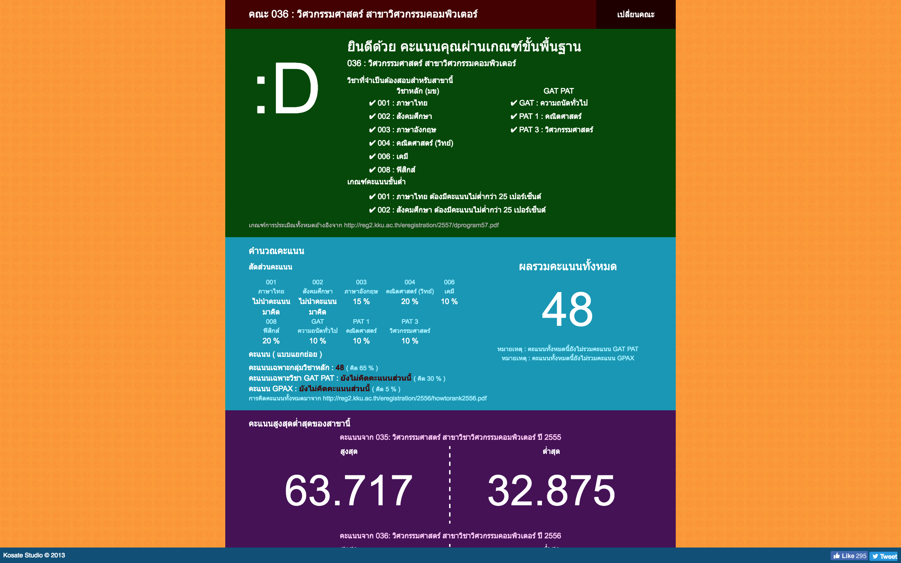

Kornkern University Scoring
===

This project is a web-application tool for calculating the score of
Kornkern University in northeastern region of Thailand.

Try project here [http://kosate.com/project/kku-score/](http://kosate.com/project/kku-score/)

## Features
- Flexible for score input. Input divided to 3 parts. Not necessary to input every part for calculate.
- Compare the result of score to the previous 2 year score history.
- Provide informative information of how to calculating the score.
- Recommendation system, the program can guide the GAT-PAT score,
how many scores in each subject that require to achieve the expect Kornkern Univesity standard scoring.

## Process of Project
- Everything about calculation written in JavaScript.
- Scoring data keep in `data_min.json` with some guidance config in `data_config.json`
- The recommendation using binary search algorithm for fast result.
- Design & color, everything done by me.

## Author
- Kosate Limpongsa (Me)

## License
The MIT License (MIT)
Copyright (c) 2013 Kosate Limpongsa

Permission is hereby granted, free of charge, to any person obtaining a copy of this software and associated documentation files (the "Software"), to deal in the Software without restriction, including without limitation the rights to use, copy, modify, merge, publish, distribute, sublicense, and/or sell copies of the Software, and to permit persons to whom the Software is furnished to do so, subject to the following conditions:

The above copyright notice and this permission notice shall be included in all copies or substantial portions of the Software.

THE SOFTWARE IS PROVIDED "AS IS", WITHOUT WARRANTY OF ANY KIND, EXPRESS OR IMPLIED, INCLUDING BUT NOT LIMITED TO THE WARRANTIES OF MERCHANTABILITY, FITNESS FOR A PARTICULAR PURPOSE AND NONINFRINGEMENT. IN NO EVENT SHALL THE AUTHORS OR COPYRIGHT HOLDERS BE LIABLE FOR ANY CLAIM, DAMAGES OR OTHER LIABILITY, WHETHER IN AN ACTION OF CONTRACT, TORT OR OTHERWISE, ARISING FROM, OUT OF OR IN CONNECTION WITH THE SOFTWARE OR THE USE OR OTHER DEALINGS IN THE SOFTWARE.
